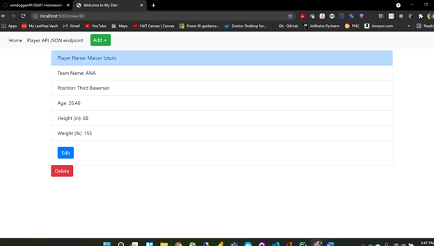

# IS 601 Final Project

My final project was to create a flask application that is based on the tutorial found at https://hackersandslackers.com/your-first-flask-application.  

Data for the project is based on an earlier project, found on my GitHub at https://github.com/wmduggan41/IS601-Project-3.  

### Show website page
Show homepage from `localhost:5000` page.

### View Player Page
View player can be added updated using the `view.html` page.

### Edit Existing Player Page
An existing player can be updated using the `edit.html` page.

### Add Player Page
Add new player using the `add.html` page.

### View changes
Im in the MLB!

### Delete Existing Player Page
An existing player can be added updated using the `edit.html` page.
